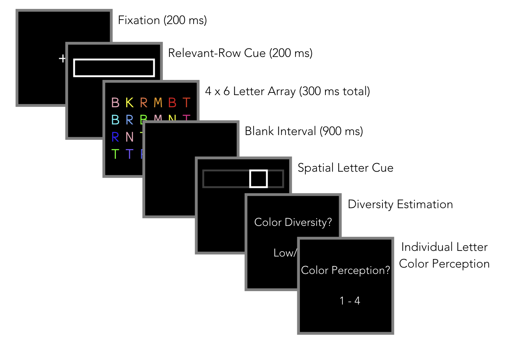

#### Article ID: UAIUi
#### Pilot: Kyle MacDonald
#### Co-pilot: Tom Hardwicke  
#### Start date: Apr 12 2017
#### End date: May 2 2017 
#### Final verification: Tom Hardwicke
#### Date: Nov 13 2017

-------

#### Methods summary: 

On each trial, Ward et al. showed adult participants 24 individual letters (e.g., "A") on a computer screen arranged in a 4 by 6 array for a duration of 300 ms. The rows of the array varied in the amount of color diversity that was present (high vs. low). The task cued participants to attend to one of the rows and then to one of the letters in that row via spatial cues (boxes around the letters) and measured participants' memory for the (a) identity of the cued letter, (b) the amount of color diversity in the cued row, and (c) the color of the cued letter (see Figure below for the task sequence). The dependent variable is the proportion correct for the various combinations of trial types. 



------

#### Target outcomes: 

For this article, we will focus on the findings reported for Experiment 1 in section 2.2. Specifically, we will attempt to reproduce all descriptive and inferential analyses reported in the text below and associated tables/figures:

> The first step in our analyses was to average six key measurements across all participants: Letter Recall Accuracy, Letter Recall Accuracy by Cue Type (whether observers were asked about the color diversity of cued or uncued rows), Color Diversity Accuracy, Color Diversity Accuracy by Cue Type (cued or uncued rows), Color Diversity Accuracy by Diversity Type (high or low), and Color Diversity Accuracy by Cue Type and Diversity Type (interaction). These measurements are included in Table 1, along with the relevant statistics that highlight significant performance. In general, letter recall accuracy was well above chance (11.11%), and (as depicted in Fig. 3A) observers were also able to correctly report color diversity above chance (50.00%).
  
Here's the relevant table from the paper:  


------

```{r global_options, include=FALSE}
knitr::opts_chunk$set(echo=TRUE, warning=FALSE, message=FALSE)

# prepare an empty report object, we will update this each time we run compareValues2()
reportObject <- data.frame("Article_ID" = NA, "valuesChecked" = 0, "eyeballs" = 0, "Total_df" = 0, "Total_p" = 0, "Total_mean" = 0, "Total_sd" = 0, "Total_se" = 0, "Total_ci" = 0, "Total_bf" = 0, "Total_t" = 0, "Total_F" = 0, "Total_es" = 0, "Total_median" = 0, "Total_irr" = 0, "Total_r" = 0, "Total_z" = 0, "Total_coeff" = 0, "Total_n" = 0, "Total_x2" = 0, "Total_other" = 0, "Insufficient_Information_Errors" = 0, "Decision_Errors" = 0, "Major_Numerical_Errors" = 0, "Minor_Numerical_Errors" = 0, "Major_df" = 0, "Major_p" = 0, "Major_mean" = 0, "Major_sd" = 0, "Major_se" = 0, "Major_ci" = 0, "Major_bf" = 0, "Major_t" = 0, "Major_F" = 0, "Major_es" = 0, "Major_median" = 0, "Major_irr" = 0, "Major_r" = 0, "Major_z" = 0, "Major_coeff" = 0, "Major_n" = 0, "Major_x2" = 0, "Major_other" = 0, "affectsConclusion" = NA, "error_typo" = 0, "error_specification" = 0, "error_analysis" = 0, "error_data" = 0, "error_unidentified" = 0, "Author_Assistance" = NA, "resolved_typo" = 0, "resolved_specification" = 0, "resolved_analysis" = 0, "resolved_data" = 0, "correctionSuggested" = NA, "correctionPublished" = NA)
```

## Step 1: Load packages

```{r}
# install.packages(c("tidyverse", "knitr", "haven", "readxl", "CODreports", "magrittr", "stringr"))
library(tidyverse) # for data munging
library(knitr) # for kable table formating
library(haven) # import and export 'SPSS', 'Stata' and 'SAS' Files
library(readxl) # import excel files
library(CODreports) # custom report functions
library(magrittr) # for compound pipes
library(stringr) # for working with strings
library(broom) # to tidy anova output
```

## Step 2: Load data

Load sheet 2 from the excel document. Sheet 1 contained helpful information about the data and analyses.

```{r}
d <- read_excel(path = "data/data.xls", sheet = 2)
```

## Step 3: Tidy data

Data were already in tidy format.

### Data checks

Do we have 12 participants?

```{r}
n_expected <- 12

n_test <- d %>% 
  select(subject) %>% 
  unique() %>% 
  nrow() == n_expected
```

Test output: `r n_test`. So we have `r n_expected` participants.

Do we have the expected number of trials for each participant? From the article, 

> The experiment began with a supervised 70-trial practice block in which observers’ only task was to report the postcued letter. Observers were then shown an example of a row of letters with high color diversity, and another with low color diversity. Observers then completed 272 experimental trials, receiving a short, self-terminated break every 96 trials and a 1.5-min mandatory break every 192 trials. (p. 81)

```{r}
n_exp_trials <- 70 + 272

# get the n trials for each ss
n_trials <- d %>% 
  group_by(subject) %>% 
  summarise(n_trials = n()) 

# check n trials against expected trials for each ss
n_trials_test <- sum(n_trials$n_trials == n_exp_trials) == 12 
```

Test output: `r n_trials_test`. Yes, we have `r n_exp_trials` for each participant.

## Step 4: Run analysis

### Descriptive statistics

Try to reproduce the accuracy scores for Experiment 1 reported in Table 1. Ward et al. provided a helpful codebook in the first sheet of their excel file that explains the computation for each cell in the table and the type of inferential statistics used for each hypothesis test. 

1. *Letter recall analysis*: From the codebook, 

> letterRecallAccuracy averaged across subjects for mainExperiment only

```{r}
ss_lr <- d %>% 
  filter(trialType == "mainExperiment") %>% 
  group_by(subject) %>% 
  summarise(accuracy_ss = mean(letterRecallAccuracy)) 


datsum <- ss_lr %>% 
  ungroup() %>% 
  summarise(n = n(),
    accuracy = mean(accuracy_ss) * 100,
            sd = sd(accuracy_ss) * 100) %>% 
  mutate(analysis = "letter_recall")
```

```{r}
reportObject <- compareValues2(reportedValue = "57.32", obtainedValue = datsum$accuracy, valueType = 'mean')
reportObject <- compareValues2(reportedValue = "17.78", obtainedValue = datsum$sd, valueType = 'sd')
```

2. *Letter recall – cue type*: From the codebook,

> letterRecallAccuracy averaged across subjects by cueType (mainExperiment only)

```{r}
ss_lr_cue_type <- d %>% 
  filter(trialType == "mainExperiment") %>% 
  group_by(subject, cueType) %>% 
  summarise(accuracy_ss = mean(letterRecallAccuracy)) 


datsum <- ss_lr_cue_type %>% 
  group_by(cueType) %>% 
  summarise(n = n(),
            accuracy = mean(accuracy_ss) * 100,
            sd = sd(accuracy_ss) * 100) %>% 
  mutate(analysis = "letter_recall_by_cue_type") %>% 
  mutate_if(is.numeric, round, digits = 2)
```

```{r}
reportObject <- compareValues2(reportedValue = "59.10", obtainedValue = datsum %>% filter(cueType == 'cued') %>% pull(accuracy), valueType = 'mean')
reportObject <- compareValues2(reportedValue = "19.51", obtainedValue = datsum %>% filter(cueType == 'cued') %>% pull(sd), valueType = 'sd')

reportObject <- compareValues2(reportedValue = "55.19", obtainedValue = datsum %>% filter(cueType == 'noncued') %>% pull(accuracy), valueType = 'mean')
reportObject <- compareValues2(reportedValue = "17.23", obtainedValue = datsum %>% filter(cueType == 'noncued') %>% pull(sd), valueType = 'sd')
```

The obtained values match the reproduced values for letter recall accuracy.

3. *Color diversity*: From the codebook,

> diversityAccuracy averaged across subjects (mainExperiment only)

```{r}
ss_div <- d %>% 
  filter(trialType == "mainExperiment") %>% 
  group_by(subject) %>%
  mutate(diversityAccuracy = as.numeric(diversityAccuracy)) %>% 
  summarise(accuracy_ss = mean(diversityAccuracy)) 

ms_div <- ss_div %>% 
  ungroup() %>% 
  summarise(n = n(),
            accuracy = mean(accuracy_ss) * 100,
            sd = sd(accuracy_ss) * 100) %>% 
  mutate(analysis = "diversity") %>% 
  mutate_if(is.numeric, round, digits = 2) 

ms_div %>% kable()
```

```{r}
# mean
#reportObject <- compareValues2(reportedValue = "64.07", obtainedValue = ms_div$accuracy, valueType = 'mean')

# sd
#reportObject <- compareValues2(reportedValue = "7.81", obtainedValue = ms_div$sd, valueType = 'sd')
```

NB - when we first rant the analysis as above - the obtained mean and standard deviation of Diversity Accuracy were different from the reported values. We contacted the corresponding author of the original article to ask about this issue. The author advised that "Instead of getting a single mean for color diversity accuracy for each subject, then calculating the grand mean (and SD) across those values, I had broken down the accuracy values by another condition first ('diversityType'), then averaged (and took the SD)." We repeated the analysis in this way (below):

```{r}
ms_div <- d %>% filter(trialType == "mainExperiment") %>% 
  group_by(subject, diversityType) %>%
  mutate(diversityAccuracy = as.numeric(diversityAccuracy)) %>%
  summarise(accuracy_ss = mean(diversityAccuracy)) %>%
  ungroup() %>% 
  summarise(n = n(),
            accuracy = mean(accuracy_ss) * 100,
            sd = sd(accuracy_ss) * 100) %>% 
  mutate(analysis = "diversity") 
```
  
```{r}
# mean
reportObject <- compareValues2(reportedValue = "64.07", obtainedValue = ms_div$accuracy, valueType = 'mean')

# sd
reportObject <- compareValues2(reportedValue = "7.81", obtainedValue = ms_div$sd, valueType = 'sd')
```

It now appears that we can reproduce the values.

4. *Color diversity by cue type*: From the codebook,

> diversityAccuracy averaged across subjects by cueType (mainExperiment only)

```{r}
ss_div_by_cue <- d %>% 
  filter(trialType == "mainExperiment") %>% 
  group_by(subject,cueType) %>%
  mutate(diversityAccuracy = as.numeric(diversityAccuracy)) %>% 
  summarise(accuracy_ss = mean(diversityAccuracy)) 

datsum <- ss_div_by_cue %>% 
  group_by(cueType) %>% 
  summarise(n = n(),
            accuracy = mean(accuracy_ss) * 100,
            sd = sd(accuracy_ss) * 100) %>% 
  mutate(analysis = "diversity_by_cue_type")
```

```{r}
reportObject <- compareValues2(reportedValue = "63.66", obtainedValue = datsum %>% filter(cueType == 'cued') %>% pull(accuracy), valueType = 'mean')
reportObject <- compareValues2(reportedValue = "7.78", obtainedValue = datsum %>% filter(cueType == 'cued') %>% pull(sd), valueType = 'sd')

reportObject <- compareValues2(reportedValue = "64.74", obtainedValue = datsum %>% filter(cueType == 'noncued') %>% pull(accuracy), valueType = 'mean')
reportObject <- compareValues2(reportedValue = "5.29", obtainedValue = datsum %>% filter(cueType == 'noncued') %>% pull(sd), valueType = 'sd')
```

The obtained values match the reproduced values for color diversity by cue type.

5. *Color diversity by diversity type*: From the codebook,

> diversityAccuracy averaged across subjects by diversityType (mainExperiment only)

```{r}
ss_div_by_div <- d %>% 
  filter(trialType == "mainExperiment") %>% 
  group_by(subject, diversityType) %>%
  mutate(diversityAccuracy = as.numeric(diversityAccuracy)) %>% 
  summarise(accuracy_ss = mean(diversityAccuracy)) 

datsum <- ss_div_by_div %>% 
  group_by(diversityType) %>% 
  summarise(n = n(),
            accuracy = mean(accuracy_ss) * 100,
            sd = sd(accuracy_ss) * 100) %>% 
  mutate(analysis = "diversity_by_div_type")
```

```{r}
reportObject <- compareValues2(reportedValue = "62.98", obtainedValue = datsum %>% filter(diversityType == 'high') %>% pull(accuracy), valueType = 'mean')
reportObject <- compareValues2(reportedValue = "9.84", obtainedValue = datsum %>% filter(diversityType == 'high') %>% pull(sd), valueType = 'sd')

reportObject <- compareValues2(reportedValue = "65.16", obtainedValue = datsum %>% filter(diversityType == 'low') %>% pull(accuracy), valueType = 'mean')
reportObject <- compareValues2(reportedValue = "5.32", obtainedValue = datsum %>% filter(diversityType == 'low') %>% pull(sd), valueType = 'sd')
```

The obtained values match the reproduced values for color diversity by diversity type.

### Inferential statistics

1. *Letter recall*: use t-test to compare to chance [11.11%]. $t = 9.0, p < .001, d = 2.6$

```{r}
t.out <- ss_lr %>% 
  mutate(accuracy_ss_new = accuracy_ss * 100) %>% 
  .$accuracy_ss_new %>% 
  t.test(mu = 11.11)

reportObject <- compareValues2(reportedValue = "9.0", obtainedValue = t.out$statistic, valueType = 't')
reportObject <- compareValues2(reportedValue = "eyeballMATCH", obtainedValue = t.out$p.value, valueType = 'p')
```


Check Cohen's D (expecting 2.6)

```{r}
null_m <- .1111
acc_reported_d <- 2.6

coh_d <- ss_lr %>% 
  summarise(m = mean(accuracy_ss),
            stdev = sd(accuracy_ss)) %>% 
  mutate(coh_d = (m - null_m) / stdev)

reportObject <- compareValues2(reportedValue = "2.6", obtainedValue = coh_d$coh_d, valueType = 'es')
```

This value matches the reported Cohen's d.

2. *Letter recall -- cue type*: use 1-way ANOVA to compare effect of cueType on letter recall accuracy. $F = 2.11, p = 0.17, \eta_p^2 = 0.16$

```{r}
m1 <- aov(accuracy_ss ~ cueType + Error(subject / cueType), 
          data = ss_lr_cue_type)

reportObject <- compareValues2(reportedValue = "2.11", obtainedValue = tidy(m1$`subject:cueType`)$statistic[1], valueType = 'F')
reportObject <- compareValues2(reportedValue = "0.17", obtainedValue = tidy(m1$`subject:cueType`)$p.value[1], valueType = 'p')
```

From the results section, it wasn't immediately clear whether Ward et al. did a repeated measures ANOVA here. But when you include this information in the model, the $F$ and $p$ match.

Check the effect size: $SS_{effect} / SS{resdiual}$ (from http://www.statisticshowto.com/eta-squared/)

```{r}
lr_eta <- round(0.00919 / (0.00919 + 0.04798), 2)

reportObject <- compareValues2(reportedValue = "0.16", obtainedValue = lr_eta, valueType = 'es')
```

$\eta_p^2$ values match reported values.

3. *Color diversity*: use t-test to compare to chance [50%]. $t = 10.10, p < .001, d = 2.92$

```{r}
t.out <- ss_div %>% 
  mutate(accuracy_ss_new = accuracy_ss * 100) %>% 
  .$accuracy_ss_new %>% 
  t.test(mu = 50)
```

```{r}
reportObject <- compareValues2(reportedValue = "10.10", obtainedValue = t.out$statistic, valueType = 't')
reportObject <- compareValues2(reportedValue = "eyeballMATCH", obtainedValue = t.out$p.value, valueType = 'p')
```

Check the effect size:

```{r}
null_m <- 0.5
div_reported_d <- 2.92

div_coh_d <- ss_div %>% 
  summarise(m = mean(accuracy_ss),
            stdev = sd(accuracy_ss)) %>% 
  mutate(coh_d = (m - null_m) / stdev)

reportObject <- compareValues2(reportedValue = "2.92", obtainedValue = div_coh_d$coh_d, valueType = 'es')
```

4-6. *Color diversity as a function of cue type and diversity type*: From the codebook,

> (use 2 [cueType] x 2 [diversityType] ANOVA to find main effect of cueType on color diversity accuracy

I wasn't exactly sure how they applied the 2 x 2 ANOVA in this case. Based on the codebook it seemed like they ran 3 separate models, but what I think they actually did was fit one model with two main effects and an interaction term (cue type, diversity type, cue X diversity type). Here's my attempt at reproducing their analysis: 

```{r}
ss_anova_div <- d %>% 
  filter(trialType == "mainExperiment") %>% 
  group_by(subject, cueType, diversityType) %>%
  mutate(diversityAccuracy = as.numeric(diversityAccuracy)) %>% 
  summarise(accuracy_ss = mean(diversityAccuracy)) 

m.int <- aov(accuracy_ss ~ cueType * diversityType + Error(subject / (cueType * diversityType)), 
             data = ss_anova_div)

summary(m.int) 
```

It was also not clear that they were accounting for the repeated measures in their model, but I ran a two-way repeated measures and the F-statistics and p-values match the reported values (Cue Type: $F = 0.19, p =  0.67$; Diversity Type: $F = 0.09, p = 0.77$; Cue Type x Diversity type: $F = 0.03, p = 0.86$).

```{r}
reportObject <- compareValues2(reportedValue = "0.19", obtainedValue = tidy(m.int$`subject:cueType`)$statistic[1], valueType = 'F')
reportObject <- compareValues2(reportedValue = "0.67", obtainedValue = tidy(m.int$`subject:cueType`)$p.value[1], valueType = 'p')

reportObject <- compareValues2(reportedValue = "0.09", obtainedValue = tidy(m.int$`subject:diversityType`)$statistic[1], valueType = 'F')
reportObject <- compareValues2(reportedValue = "0.77", obtainedValue = tidy(m.int$`subject:diversityType`)$p.value[1], valueType = 'p')

reportObject <- compareValues2(reportedValue = "0.03", obtainedValue = tidy(m.int$`subject:cueType:diversityType`)$statistic[1], valueType = 'F')
reportObject <- compareValues2(reportedValue = "0.86", obtainedValue = tidy(m.int$`subject:cueType:diversityType`)$p.value[1], valueType = 'p')
```

Check the $\eta^2$ values using $SS_{effect} / SS_{total}$

```{r}
# cue type
pes1 <- 0.00171 / (0.0011 + 0.10013)
reportObject <- compareValues2(reportedValue = "0.02", obtainedValue = pes1, valueType = 'es')

# diversity type
pes2 <- 0.0011 / (0.0011 + 0.1341)
reportObject <- compareValues2(reportedValue = "0.01", obtainedValue = pes2, valueType = 'es')

# cue type by diversity type interaction
pes3 <- 0.00046 / (0.00046 + 0.16049)
reportObject <- compareValues2(reportedValue = "eyeballMATCH", obtainedValue = pes3, valueType = 'es')
```

The effect size measures match the reported values.

## Step 5: Conclusion

Overall, we thought the authors did a good job facilitating reproducibility by providing a tidy data file with relatively clear documentation about the variable types and about how to perform the various analyses. The only place we had trouble reproducing the reported values was the *Color Diversity Accuracy* analysis. Initially we obtained a different mean value and a different standard deviation. We contacted the corresponding author for clarification and she quickly identified the problem: "Instead of getting a single mean for color diversity accuracy for each subject, then calculating the grand mean (and SD) across those values, I had broken down the accuracy values by another condition first ('diversityType'), then averaged (and took the SD)." This is not what we expected from what was reported in the paper. However, when we followed the authors' instructions for this different type of analysis we were able to successfully reproduce the target values.

```{r}
reportObject$Article_ID <- "UAIUi"
reportObject$affectsConclusion <- "no"
reportObject$error_typo <- 0
reportObject$error_specification <- 0
reportObject$error_analysis <- 0
reportObject$error_data <- 0
reportObject$error_unidentified <- 0
reportObject$Author_Assistance <- T
reportObject$resolved_typo <- 0
reportObject$resolved_specification <- 1
reportObject$resolved_analysis <- 0
reportObject$resolved_data <- 0
reportObject$correctionSuggested <- "no"
reportObject$correctionPublished <- F

# decide on final outcome
if(reportObject$Decision_Errors > 0 | reportObject$Major_Numerical_Errors > 0 | reportObject$Insufficient_Information_Errors > 0){
  reportObject$finalOutcome <- "Failure"
  if(reportObject$Author_Assistance == T){
    reportObject$finalOutcome <- "Failure despite author assistance"
  }
}else{
  reportObject$finalOutcome <- "Success"
  if(reportObject$Author_Assistance == T){
    reportObject$finalOutcome <- "Success with author assistance"
  }
}

# save the report object
filename <- paste0("reportObject_", reportObject$Article_ID,".csv")
write_csv(reportObject, filename)
```

## Report Object

```{r, echo = FALSE}
# display report object in chunks
kable(reportObject[2:10], align = 'l')
kable(reportObject[11:20], align = 'l')
kable(reportObject[21:25], align = 'l')
kable(reportObject[26:30], align = 'l')
kable(reportObject[31:35], align = 'l')
kable(reportObject[36:40], align = 'l')
kable(reportObject[41:45], align = 'l')
kable(reportObject[46:51], align = 'l')
kable(reportObject[52:57], align = 'l')
```

## Session information

```{r session_info, include=TRUE, echo=TRUE, results='markup'}
devtools::session_info()
```
