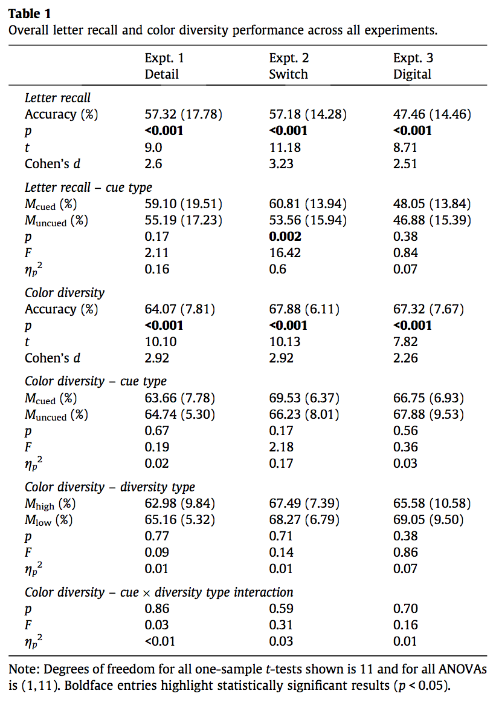

#### Article ID: UAIUi
#### Pilot: Kyle MacDonald
#### Co-pilot: Tom Hardwicke  
#### Start date: 4/12/17
#### End date: [Insert end date - use US format]   

-------

#### Methods summary: 
[Write a brief summary of the methods underlying the target outcomes written in your own words]

------

#### Target outcomes: 

For this article you should focus on the findings reported for Experiment 1 in section 2.2. Specifically, you should attempt to reproduce all descriptive and inferential analyses reported in the text below and associated tables/figures:

> The first step in our analyses was to average six key measurements across all participants: Letter Recall Accuracy, Letter Recall Accuracy by Cue Type (whether observers were asked about the color diversity of cued or uncued rows), Color Diversity Accuracy, Color Diversity Accuracy by Cue Type (cued or uncued rows), Color Diversity Accuracy by Diversity Type (high or low), and Color Diversity Accuracy by Cue Type and Diversity Type (interaction). These measurements are included in Table 1, along with the relevant statistics that highlight significant performance. In general, letter recall accuracy was well above chance (11.11%), and (as depicted in Fig. 3A) observers were also able to correctly report color diversity above chance (50.00%).
  
Here's the relevant table from the paper:  



------

```{r global_options, include=FALSE}
knitr::opts_chunk$set(echo=TRUE, warning=FALSE, message=FALSE)
```

## Step 1: Load packages

[Some useful packages are being loaded below. You can add any additional ones you might need too.]

```{r}
# install.packages(c("tidyverse", "knitr", "haven", "readxl", "CODreports", "magrittr", "stringr"))
library(tidyverse) # for data munging
library(knitr) # for kable table formating
library(haven) # import and export 'SPSS', 'Stata' and 'SAS' Files
library(readxl) # import excel files
library(CODreports) # custom report functions
library(magrittr)
library(stringr)
```

## Step 2: Load data

```{r}
d <- read_excel()
```

## Step 3: Tidy data

```{r}
```

## Step 4: Run analysis

### Pre-processing

[you can remove this section if no pre-processing is required]

```{r}
```

### Descriptive statistics

```{r}
```

### Inferential statistics

```{r}
```

## Step 5: Conclusion

```{r}
```

[Please also include a brief text summary describing your findings. If this reproducibility check was a failure, you should note any suggestions as to what you think the likely cause(s) might be.]

[This function will output information about the package versions used in this report:]

```{r session_info, include=TRUE, echo=TRUE, results='markup'}
devtools::session_info()
```
